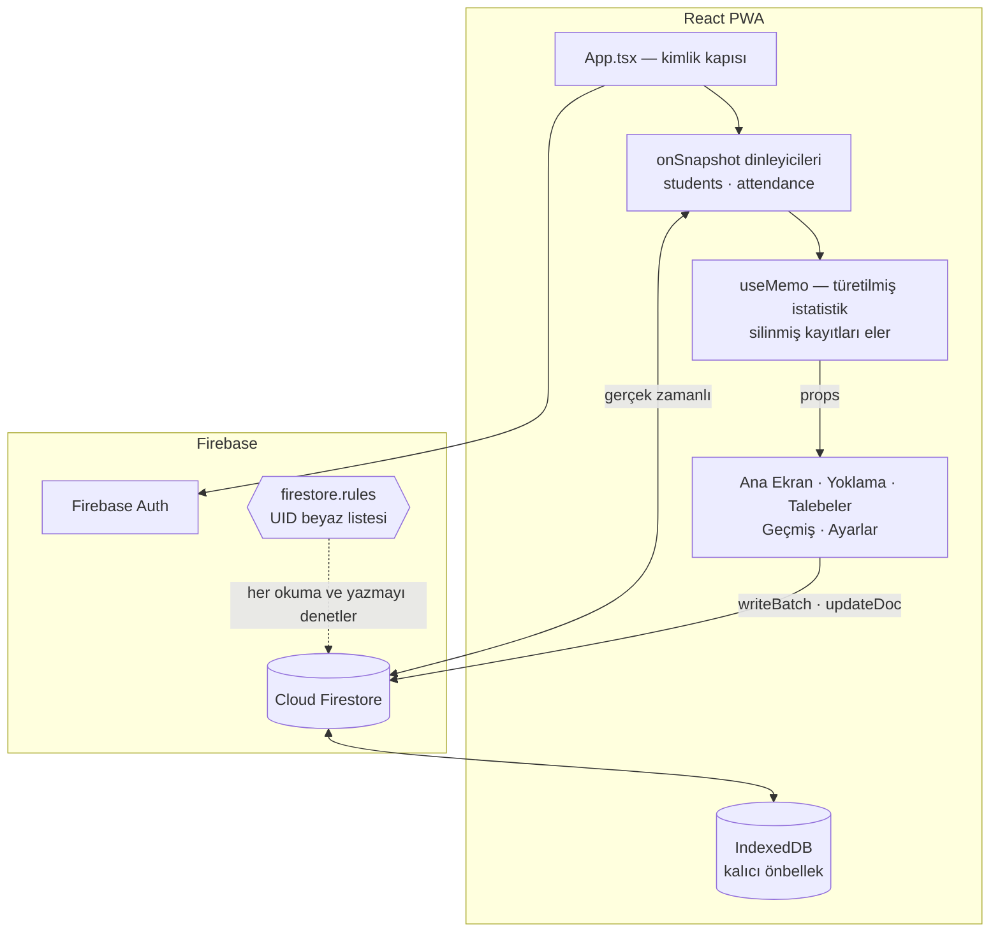

# Yoklama Takip Sistemi

Yurt/pansiyon talebeleri için **mobil öncelikli Progressive Web App**. Etüt ve namaz yoklamalarını alır, talebe kayıtlarını yönetir, geçmişi filtreler ve rapor dışa aktarır.

React 19, TypeScript ve Cloud Firestore ile yazılmıştır. Arayüz tamamen Türkçedir.

**Canlı:** https://yoklama-takip-mauve.vercel.app

## Özellikler

- **Yoklama takibi** — İki seans türü (dahili ders, namaz), dört durum: geldi, geç, devamsız, izinli
- **Akıllı filtreleme** — Dahili ders yoklamasında talebeler atandıkları gruba göre listelenir
- **Talebe yönetimi** — Yurt içi ve yurt dışı telefon desteği, mükerrer ad-soyad kontrolü, grup mesulü ataması
- **Excel'den toplu ekleme** — Şablon indirme, esnek sütun ve değer eşleme (kısaltmalar, yıl ekleri), satır bazlı doğrulama ve önizleme
- **Geçmiş** — Kayıtları tarih ve seansa göre filtreleme, tekil veya toplu silme
- **Geri alınabilir silme** — Kayıtlar yok edilmez, arşivlenir ve bildirimdeki "Geri Al" ile kurtarılabilir
- **CSV dışa aktarma** — Excel uyumlu, özet istatistikli rapor
- **Çevrimdışı çalışma** — Firestore kalıcı önbelleği; bağlantı dönünce eşitlenir
- **Kurulabilir** — Ana ekrandan yerel uygulama gibi açılır

## Teknoloji

| Katman | Teknoloji |
|--------|-----------|
| Arayüz | React 19, TypeScript |
| Derleme | Vite 7 |
| Stil | Tailwind CSS 3 |
| Veritabanı | Cloud Firestore (gerçek zamanlı) |
| Kimlik doğrulama | Firebase Authentication |
| PWA | vite-plugin-pwa (Workbox) |

## Mimari

Ayrı bir sunucu katmanı yoktur; istemci doğrudan Firestore ile konuşur. Bu nedenle tutarlılığı sağlayan iki şey vardır: **aboneliklerin nerede açıldığı** ve **güvenlik kurallarının neye izin verdiği**. Tüm gerçek zamanlı dinleyiciler bir kez [`App.tsx`](src/App.tsx) içinde açılır ve aşağıya props olarak iner; hiçbir sayfa kendi aboneliğini açmaz.



### Tasarım kararları

| Karar | Gerekçe |
|---|---|
| **Tüm dinleyiciler `App.tsx`'te, sayfalarda değil** | Beş ekran aynı iki koleksiyonu okur. Sayfa başına abonelik, aynı veriyi tekrar tekrar okumak ve ekranların birbirinden farklı durum göstermesi demektir. Tek abonelik kümesiyle her ekran aynı anlık görüntüden render edilir. |
| **Yoklama kaydı için tek `writeBatch`** | Talebe başına okuma + yazma yapmak 30 kişilik bir seansta 60 tur demek olurdu ve yarısı başarısız olabilirdi. Tek sorgu mevcut kayıtları yükler, tek batch tüm değişiklikleri yazar: 2 tur ve ya hepsi ya hiçbiri. |
| **`deleteDoc` yerine yumuşak silme** | Silmeler toplu yapılır; "tümünü sil" yanlışlıkla bir günün tamamını yok edebilir. Yazmalar `isDeleted` bayrağı koyar, dinleyiciler bunları eler — görünüş aynı, ama geri alınabilir. |
| **Grup değerleri esnek eşleştirilir** | Listeler farklı ellerden geliyor: aynı grup "K.Kerim", "kkrm" ya da "2026 Grup Hazırlık" diye yazılabiliyor. İçe aktarmada yıl ve "grup" gibi ekler ayıklanıp kısaltmalara bakılır. Tanınmayan değer sessizce bir gruba atanmaz, satır hatayla işaretlenir. |
| **Telefonda ülke kalıbı zorlanmaz** | Talebelerin bir kısmı yurt dışından geldiği için numaralar tek bir kalıba sığmıyor. Türk cep numaraları tanınıp "5XX XXX XX XX" olarak düzenlenir; diğerleri girildiği gibi saklanır ve yalnızca hane sayısı (7–15) kontrol edilir. Eskiden kalıba uymayan numara sessizce boşaltılıyordu. |
| **Kayıtlarda `updatedAt`** | `date` alanı gün başına sabitlenir (12:00), yani aynı günün seansları aynı damgayı taşır. Ana ekrandaki "günün son yoklaması" ancak kaydın yazılma anıyla doğru bulunabilir. |
| **Güvenlik kurallarında UID beyaz listesi** | Firebase web anahtarı istemci paketiyle birlikte dağıtıldığı için, `request.auth != null` yeterli olsaydı hesap açan herkes talebelerin TC ve veli telefon bilgilerine erişebilirdi. Erişim, açıkça listelenen yönetici UID'leriyle sınırlıdır. |
| **Kalıcı Firestore önbelleği** | Yoklama, bağlantının güvenilmez olduğu bir yurtta alınır; yarım kalmış bir seans hiç başlanmamış olandan kötüdür. Önbellek çevrimdışı okuma/yazmayı sürdürür, bağlantı dönünce eşitler. |

## Kurulum

```bash
npm install
```

Firebase konsolundan aldığınız web yapılandırmasını girin:

```bash
cp .env.example .env.local
```

Ardından geliştirme sunucusunu başlatın:

```bash
npm run dev
```

## Başka bir bilgisayarda çalışmak

Depoyu klonlamak tek başına yeterli değildir. İki şey ayrıca gerekir:
depo gizli olduğu için **GitHub erişimi**, ve Firebase anahtarlarını tutan
`.env.local` dosyası depoya dahil edilmediği için (`.gitignore`) **o dosyanın
yeniden oluşturulması**.

### 1. Ön gereksinimler

| Araç | Sürüm | Kontrol |
|---|---|---|
| Node.js | 20.19+ veya 22.12+ (LTS önerilir) | `node -v` |
| npm | Node ile birlikte gelir | `npm -v` |
| Git | Herhangi bir güncel sürüm | `git --version` |

Node kurulu değilse [nodejs.org](https://nodejs.org) adresinden LTS sürümünü
kurun. macOS'ta `brew install node` da olur. Git macOS'ta Xcode Command Line
Tools ile gelir (`xcode-select --install`), Windows'ta
[git-scm.com](https://git-scm.com) üzerinden kurulur.

### 2. GitHub erişimi

Depo gizli, bu yüzden klonlarken kimlik doğrulaması istenir. En kolay yol
GitHub CLI:

```bash
gh auth login
```

Tarayıcıda oturum açmanızı ister, sonrasında `git` komutları kendiliğinden
yetkilenir. GitHub CLI yoksa `brew install gh` (macOS) veya
[cli.github.com](https://cli.github.com) üzerinden kurulur.

Alternatif olarak GitHub'da **Settings → Developer settings → Personal access
tokens** bölümünden `repo` yetkili bir token üretip, klonlama sırasında şifre
yerine o token'ı girebilirsiniz. (GitHub hesap şifresi kabul edilmez.)

### 3. Klonlama ve bağımlılıklar

```bash
git clone https://github.com/Furkan-T/yp-yoklama.git
cd yp-yoklama
npm install
```

`npm install` birkaç dakika sürebilir; `node_modules` klasörü de depoya dahil
değildir, her makinede yeniden kurulur.

### 4. Firebase anahtarları (`.env.local`)

Bu adım atlanırsa uygulama açılışta "Firebase yapılandırması eksik" hatası verir.

**Yol A — Vercel'den çekin (önerilir).** Anahtarlar zaten Vercel'de tanımlı:

```bash
npx vercel login
npx vercel link
npx vercel env pull .env.local
```

`vercel link` hangi hesap ve projeyle eşleşeceğini sorar; listeden
`yoklama-takip` projesini seçin. `env pull` altı `VITE_FIREBASE_*` değişkenini
`.env.local` dosyasına yazar.

**Yol B — elle girin.** Vercel kullanmak istemiyorsanız `.env.example` dosyasını
`.env.local` olarak kopyalayın ve değerleri Firebase konsolundan
(**Proje ayarları → Genel → Uygulamalarınız → Web**) alın:

```bash
cp .env.example .env.local
```

`.env.local` dosyasını e-posta veya mesajla göndermeyin; anahtarlar gizli
sayılmasa da düz metin olarak dolaştırmamak doğru alışkanlıktır.

### 5. Çalıştırma

```bash
npm run dev
```

Terminalde yazan adresi (genelde `http://localhost:5173`) tarayıcıda açın.
Giriş bilgileriniz aynıdır — kimlik doğrulama Firebase tarafında olduğu için
makineye bağlı değildir.

### 6. Günlük akış

```bash
git pull        # çalışmaya başlamadan önce
# ... değişiklikleri yapın ...
npm run lint    # isteğe bağlı, hata kontrolü
git add -A && git commit -m "mesaj"
git push        # Vercel otomatik derleyip yayına alır
```

Ayrıca bir dağıtım komutu çalıştırmak gerekmez.

> İki bilgisayarda aynı anda çalışıyorsanız her oturuma `git pull` ile başlayın;
> aksi halde `git push` çakışır.

### İsteğe bağlı araçlar

Bunlar yalnızca ilgili işi yapacaksanız gerekir:

| Araç | Ne için |
|---|---|
| `firebase-tools` | `firestore.rules` değiştirip yayınlamak (`firebase deploy --only firestore:rules`) |
| `vercel` | Anahtarları çekmek veya elle dağıtım yapmak |

### Sorun giderme

| Belirti | Sebep ve çözüm |
|---|---|
| `Firebase yapılandırması eksik: ...` | `.env.local` yok veya boş. 4. adımı uygulayın. Dosyayı değiştirdikten sonra dev sunucusunu yeniden başlatın. |
| `Repository not found` | Gizli depoya erişim yok. `gh auth login` çalıştırın veya token kullanın. |
| `Unsupported engine` / Vite açılmıyor | Node sürümü eski. `node -v` ile kontrol edin, 20.19+ veya 22.12+ olmalı. |
| `Port 5173 is in use` | Başka bir sunucu çalışıyor. Onu kapatın ya da `npm run dev -- --port 5174`. |
| Giriş oluyor ama liste boş, "yüklenemedi" uyarısı | Kullanıcının UID'si `firestore.rules` içindeki listede değil. |

## Komutlar

```bash
npm run dev      # Geliştirme sunucusu
npm run build    # Üretim derlemesi
npm run lint     # ESLint
npm run preview  # Üretim derlemesini önizle
```

Güvenlik kurallarını yayınlamak için:

```bash
firebase deploy --only firestore:rules
```

## Veri modeli

```
students/                          attendance/
  firstName, lastName, name          studentId
  group    (dahili ders grubu)       studentName
  supervisors[]  (en fazla 2)        type      (ETUT | NAMAZ)
  phone                              subType   (seans adı)
  parentName, parentPhone            status    (VAR | GEC | YOK | IZINLI)
  faculty, department, grade         date
  bloodType, country                 updatedAt
  isActive, isDeleted                isDeleted
```

`name` alanı `firstName` + `lastName`'den türetilerek ayrıca yazılır: Firestore
sorgusu buna göre sıralanır ve yoklama kayıtları talebe adını kopyalayarak saklar.

Yoklama türü anahtarı `ETUT` olarak kalmıştır; arayüzde **DAHİLİ DERS** olarak
gösterilir. Daha önce kaydedilmiş yoklamalar bu değerle yazıldığı için anahtar
değiştirilmemiştir (bkz. `TYPE_LABELS`).

## Ekranlar

| Ekran | Amaç |
|-------|------|
| Ana Ekran | Toplam ve aktif talebe sayısı; günün son seansında devamsız, geç veya izinli olanlar |
| Yoklama | Tarih, tür ve gruba göre hızlı yoklama girişi |
| Talebeler | Kayıt ekleme, düzenleme, arama, Excel'den toplu ekleme; veliye tek dokunuşla WhatsApp |
| Geçmiş | Geçmiş kayıtları tarih ve seansa göre görüntüleme ve silme |
| Ayarlar | CSV dışa aktarma, hesap bilgisi, çıkış |

## Güvenlik

Firestore kuralları tüm okuma ve yazmaları açıkça listelenen yönetici UID'leriyle sınırlar. Uygulamada kayıt ekranı yoktur; hesaplar Firebase konsolundan elle açılır. Yeni bir yönetici eklendiğinde UID'si [`firestore.rules`](firestore.rules) içindeki listeye eklenmeli ve kurallar yeniden yayınlanmalıdır.

Firebase web yapılandırması `.env.local` üzerinden okunur. Bu anahtarlar gizli değildir — projeyi tanımlarlar, kimlik doğrulamazlar; erişim denetimi tamamen güvenlik kurallarıyla yapılır.

---

Geliştiren: **Furkan Tekiroğlu**
